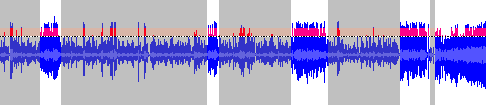

# wave-peaks

Wave data analysis and processing for finding chunks and segments of audio.

This script takes a WAV file as input and detects segments signal data over a thresshold and when a quorum is reached, the lapse is stored in a separated WAV file. This is mainly used in audio files with a long silences or long noise parts where you need to have separated the sound over this thresshold.

Lets take the following image as example of the waveform of a recorded audio with a lot of bakcground noise. In the white areas are sound wich we want to export and in the gray areas are the noisy parts we need to ignore:

The first thing this script does is read wave data and convert all values into a positive number between 0 and 32768 (16 bits), and using this range the script algorithm takes a double thresshold value:

* TOP (1-32768): defines where is the top level signal to be consider as "not-noise-signal"
* TASA (0.1-0.99): defines the amount of concurrent peaks ina segment to be considered "not-a-single-peak"

Finally the selected secctions are exported as separated audio files.
